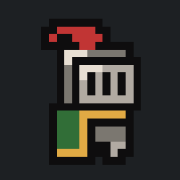

# The Coin Knight [Webgame](https://sullydux.github.io/The-Coin-Knight/) or [App](https://github.com/sullydux/The-Coin-Knight/releases/latest/)

### **Alpha 2**
v0.2.0

## What

The Coin Knight is a Godot platform-ish game. You play as a knight and collect coins.

This is my first Godot game and the base game from [Brackeys "How to make a Video Game - Godot Beginner Tutorial"](https://www.youtube.com/watch?v=LOhfqjmasi0)

## To add

This game is still in active dev with many more fetures and mechanics.

## When

Hopefully v1.0.0 will be released mid or late July.